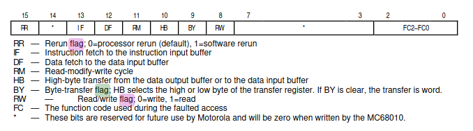

- [ ] Commit all your files to a version control system (Subversion, Git,
Mercurial or RCS). When submitting your assignment, provide a single
archive (.zip, .7z, .tgz, .tbz or .txz file with appropriate format)
with all your text sources and cited literature (bibliography if the
cited sources are large or proprietary). if you use LaTeX, provide
both the source files and the generated PDF file, along with the
generation commands. Your final text for evaluation must be a single
PDF file. Group files into appropriate directories so that they are
easy to find. Give reasonable, easy-to-recognise (not cryptic) names
for you files. If special coding (e.g. MD5 hashes or UUIDs) are used
for file names for technical reasons, explain that use in the README
file. RAR files are *not* accepted!

- [x] What was the elementary base of a computer/processor (relays,
vacuum tubes (aka thermoionic valves), transistors, magnetic cores,
integrated circuits (ICs) – were they hybrid, low scale integration,
Large Scale Integration (LSI), Very Large Scale Integration (VLSI),
modern microprocessors)? What where the physical characteristics of
the equipment (weight, size, power consumption)?

- [x] What type of architecture did both computers have? Were they
accumulator based, register based, stack based, memory-to-memory or
some other architectures?

- [x] Were they zero-address, one-address, two-address, three-address or
four address machines?

Definition - OPCODE + ADRESS 1 + ADRESS 2 (Tanenbaum, 362)
Zilog - 2 (manual, 2-11)
Mot - 2 (manual, 2-11)

- [x] What were the registers in both architectures? Did they have
registers at all? Were they general purpose registers or specialised
ones? How many registers did each architecture have? What were the
widths of these registers?

Zilog: (wikipedia)
16 16-bit registers R0-R15
can be concatenated inot 8*32bit registers RR0/RR2/../RR14
or into 4*64bit RQ0/RQ4/RQ8/RQ12
first eight --> subdivieded into sixteen 8 bit registers

R0-14 general purpose
R15 designated as stack pointer

Status register - (C)arry, (Z)ero, (S)ign, (P/V) parity / overflow, (D)ecimal adjust, (H)alf carry (manual, 2-7)

Motorola: (wikipedia)
8 32bit general purpose D0-D7
8 32bit adress registers A0-A7
dual stack pointer (user A7 and supervisor-mode A7')

BIG endian

- [x] Were the flags used in the architectures? What flags were there?
 (manual, 6-19)

Status register - (C)arry, (Z)ero, (S)ign, (P/V) parity / overflow, (D)ecimal adjust, (H)alf carry (manual, 2-7)

- [x] What was the data width (machine word) of each architecture?

Wikipedia:
Zilog, Motorola- 16bit

- [x] What was the memory layout of each system? Was address space
continuous, or was it segmented, paged, subdivided into banks? What was
the (effective) width of the address? What was the maximum possible
amount of memory in each system? What was the typical amount of memory
with which the system was used?

(wikipedia): 
zilog little endian, motorola big endian

motorola:
continuous usegmented memory space, 
24 bit addressing --> 2^24 = 16MB memory

- [x] Was virtual memory supported, and how? Was it paged or segmented?

- [ ] What was the ISA of each architecture? How many instructions did
each architecture have? What were the classes of the instructions?
What instructions formats did each architecture support? Provide
examples of some 8-16 instructions. What instructions were similar in
both architectures? Which instructions were different?

- [ ] What were the addressing modes supported by each architecture?
Which modes were similar, and which were different?

- [ ] What were the I/O capabilities of each architecture?

- [ ] Were interrupts supported for each architecture? How was the
interrupt support similar, and how was it different in both
architectures?

- [ ] What data types did each architecture support on instruction
level? Was fixed point or floating point supported by hardware and
how? Where integers sign-magnitude, one's complement, two's
complement? What other "exotic" data types did architecture support
(decimal numbers, complex numbers, etc.)?

- [ ] What was the speed of each system? How did clock frequencies, clock
cycles per instruction, instruction rates compare? Which system was
faster?

- [ ] Did the architectures use cache memory? If yes, how much?

- [ ] What were the typical application areas of each architecture? How
were they used? Describe briefly (on paragraph) one particular
installation of each architecture.

- [ ] How much software was written for each discussed architecture, is
it (still) available, what application domains did it target? What
compilers and programming tools (debuggers, profilers, assemblers) did
architectures have? What software libraries were available?

(KRANENBORG)!!!!

- [ ] (optional) are there emulators available for both architectures?
If you find some, provide their URLs and/or publication metadata.

- [ ] Make sure you cite *all* relevant sources of information that you
have used in your work. At least two sources must be among the cited
ones: the description of the architecture that you are investigating
and the description of the algorithm that you are implementing. The
sources must be cited using Harvard reference style (University of
Wolverhampton, 2022). Citations must be in the text and the full
bibliography of the sources must be provided at the end of your
report. Wikipedia (Wikipedia, 2023) are permitted of the articles are
high quality, informative and to the point (most of them are). If
ChatGPT or other Large Language Models are used, they MUST be cited as
sources, with publicly available URL, access date and time, tool
version and the full prompt.